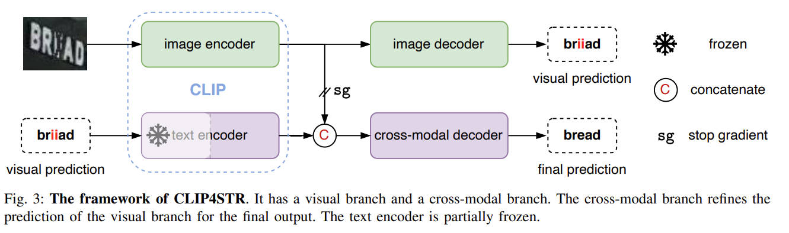
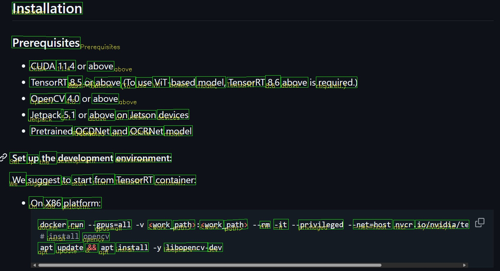

# C++ sample
We provide 3 c++ samples to illustrate the usage of nvOCDR API and library parameter tuning. You need firstly follow the [Installation](https://github.com/NVIDIA-AI-IOT/NVIDIA-Optical-Character-Detection-and-Recognition-Solution#installation) to prepare the environment to run the following samples.

- [Simple inference sample](#simple-inference-sample)
- [Crop-based inference sample](#crop-based-inference-sample)
- [nvCLIP4STR](#nvclip4str)

## Simple inference sample

The simple inference is using `nvOCDR_inference` to do the inference. It will resize the input image to the OCDNet's input shape to do detection and then feed the detected text areas to OCRNet for recognition.

Use the following command to compile the `simple_inference.cpp`:

```shell
g++ ./simple_inference.cpp -I../include -L../ -I/usr/include/opencv4/ -I/usr/local/cuda/include -L/usr/local/cuda/lib64 -lcudart -lopencv_core -lopencv_imgcodecs -lopencv_imgproc -lnvocdr -o simple_inference
```

This sample will perform on scene text dataset like ICDAR15 and Uber Text.


But if use the same inference setting to do OCR on documentation scan, it will not perform well:


## Crop-based inference sample

The crop-based inference is using `nvOCDR_high_resolution_inference` to do inference. It will firstly crop the input image to the patches with OCDNet's input shape and do detection on the cropped patches. And finally feed the detected text areas to OCRNet for recognition.

To run this sample, you need to create a new OCDNet engine with smaller input size:

```shell
/usr/src/tensorrt/bin/trtexec --onnx=./ocdnet.onnx --minShapes=input:1x3x320x320 --optShapes=input:1x3x320x320 --maxShapes=input:4x3x320x320 --fp16 --saveEngine=./ocdnet.fp16.engine
```

Use the following command to compile the `crop_based_inference.cpp`:

```shell
g++ ./crop_based_inference.cpp -I../include -L../ -I/usr/include/opencv4/ -I/usr/local/cuda/include -L/usr/local/cuda/lib64 -lcudart -lopencv_core -lopencv_imgcodecs -lopencv_imgproc -lnvocdr -o crop_based_inference
```

The crop-based inference setting is good at recognize dense text areas:


## nvCLIP4STR
### nvCLIP4STR introducion

nvCLIP4STR is based on [CLIP4STR](https://arxiv.org/abs/2305.14014). This model is clip-based atchitecture, it used [NVCLIP](https://catalog.ngc.nvidia.com/orgs/nvidia/teams/tao/models/nvclip_vit) as pretrained weights, and it will take RGB images as network input and produce sequence output. nvCLIP4STR has two encoder decoder branches: a visual branch and a cross-modal branch. The visual branch provides an initial prediction based on the visual feature, and the cross-modal branch refines this prediction by addressing the discrepancy between the visual feature and text semantics.


Because the results from visual branch will be tokenized and used as input for cross-modal branch, so we need to split nvCLIP4STR to 2 ONNX models, one is for visual branch, other one is for cross-modal branch:

* vl4str_2024-11-19-06-48-47_checkpoints_epoch_9-step_15580-val_accuracy_71.1684-val_NED_79.9133.visual.sim.onnx
* vl4str_2024-11-19-06-48-47_checkpoints_epoch_9-step_15580-val_accuracy_71.1684-val_NED_79.9133.text.sim.onnx


### nvCLIP4STR inference
In this nvCLIP4STR sample, the inference is using `CLIP4STR` for OCRnet and `vit` for OCDnet to do inference. The origin charset for this version of OCRnet includes 94 chars, you need to push these 94 chars to character_list 
```shell
0123456789abcdefghijklmnopqrstuvwxyzABCDEFGHIJKLMNOPQRSTUVWXYZ!"#$%&'()*+,-./:;<=>?@[\]^_`{|}~
```
To run this sample, you need to create 2 tensorRT engines which are visual branch engein and text branch engine from CLIP4STR respectively:

```shell
export MODEL_NAME=/home/onnx/best_ckpt/vl4str_2024-11-19-06-48-47_checkpoints_epoch_9-step_15580-val_accuracy_71.1684-val_NED_79.9133

# visual branch
trtexec --onnx=$MODEL_NAME.visual.sim.onnx \
        --minShapes=imgs:1x3x224x224  \
        --optShapes=imgs:64x3x224x224 \
        --maxShapes=imgs:64x3x224x224 \
        --saveEngine=$MODEL_NAME.visual.sim.fp16.engine \
        --memPoolSize=workspace:20480 \
        --fp16 
# text branch
trtexec --onnx=$MODEL_NAME.text.sim.onnx \
        --minShapes=text_token:1x16,img_feature:1x257x768,tgt_in:1x26 \
        --optShapes=text_token:64x16,img_feature:64x257x768,tgt_in:64x26 \
        --maxShapes=text_token:64x16,img_feature:64x257x768,tgt_in:64x26 \
        --saveEngine=$MODEL_NAME.text.sim.fp16.engine \
        --memPoolSize=workspace:20480 \
        --fp16 

```

Use the following command to compile the `simple_inference_nvCLIP4STR.cpp`:

```shell
g++ ./simple_inference_nvCLIP4STR.cpp -finput-charset=UTF-8 -I../include -L../ -I/usr/include/opencv4/ -I/usr/local/cuda/include -L/usr/local/cuda/lib64 -lcudart -lopencv_core -lopencv_imgcodecs -lopencv_imgproc -lnvocdr -o simple_inference_nvclip4str

# run sample
./simple_inference_nvclip4str
```


