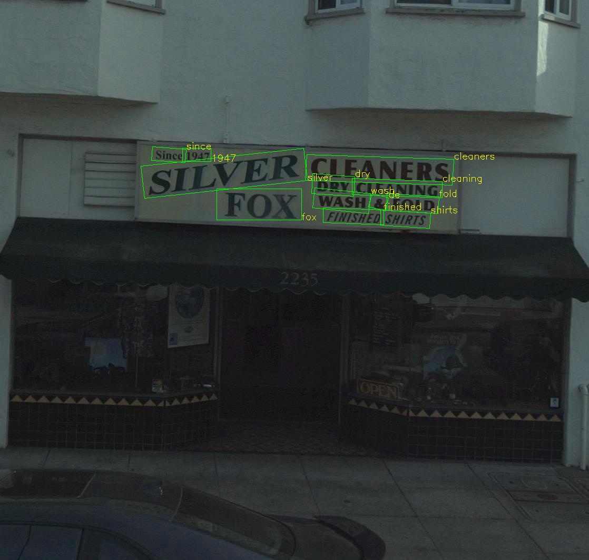
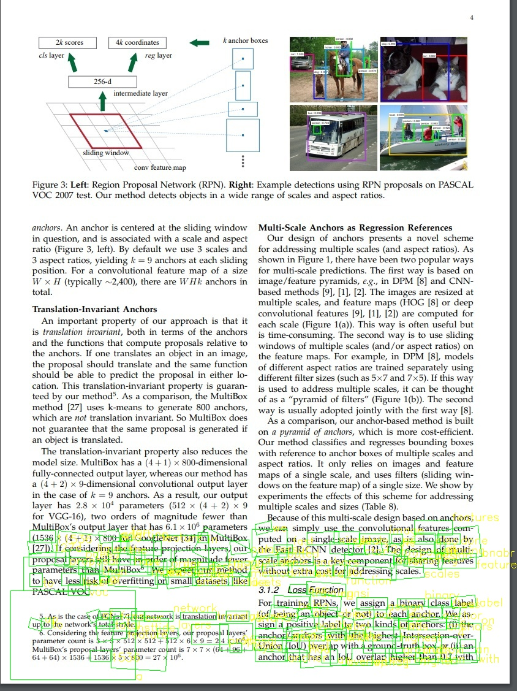
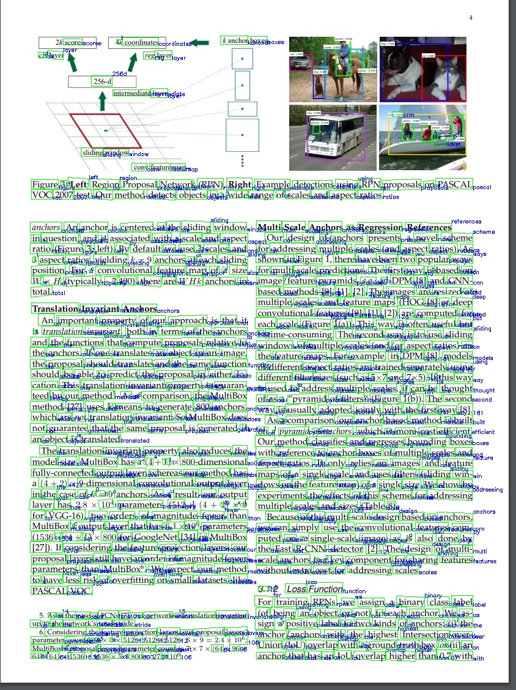

# C++ sample
We provide two c++ sample to illustrate the usage of nvOCDR API and library parameter tuning. You need firstly follow the [Installation](https://github.com/NVIDIA-AI-IOT/NVIDIA-Optical-Character-Detection-and-Recognition-Solution#installation) to prepare the environment to run the following samples.

**Note:** The samples with `_vit` suffix are for running ViT-based OCDNet and OCRNet.

## Simple inference sample

The simple inference is using `nvOCDR_inference` to do the inference. It will resize the input image to the OCDNet's input shape to do detection and then feed the detected text areas to OCRNet for recognition.

Use the following command to compile the `simple_inference.cpp`:

```shell
g++ ./simple_inference.cpp -I../include -L../ -I/usr/include/opencv4/ -I/usr/local/cuda/include -L/usr/local/cuda/lib64 -lcudart -lopencv_core -lopencv_imgcodecs -lopencv_imgproc -lnvocdr -o simple_inference
```

This sample will perform on scene text dataset like ICDAR15 and Uber Text.



But if use the same inference setting to do OCR on documentation scan, it will not perform well:



## Crop-based inference sample

The crop-based inference is using `nvOCDR_high_resolution_inference` to do inference. It will firstly crop the input image to the patches with OCDNet's input shape and do detection on the cropped patches. And finally feed the detected text areas to OCRNet for recognition.

To run this sample, you need to create a new OCDNet engine with smaller input size:

```shell
/usr/src/tensorrt/bin/trtexec --onnx=./ocdnet.onnx --minShapes=input:1x3x320x320 --optShapes=input:1x3x320x320 --maxShapes=input:4x3x320x320 --fp16 --saveEngine=./ocdnet.fp16.engine
```

Use the following command to compile the `crop_based_inference.cpp`:

```shell
g++ ./crop_based_inference.cpp -I../include -L../ -I/usr/include/opencv4/ -I/usr/local/cuda/include -L/usr/local/cuda/lib64 -lcudart -lopencv_core -lopencv_imgcodecs -lopencv_imgproc -lnvocdr -o crop_based_inference
```

The crop-based inference setting is good at recognize dense text areas:


